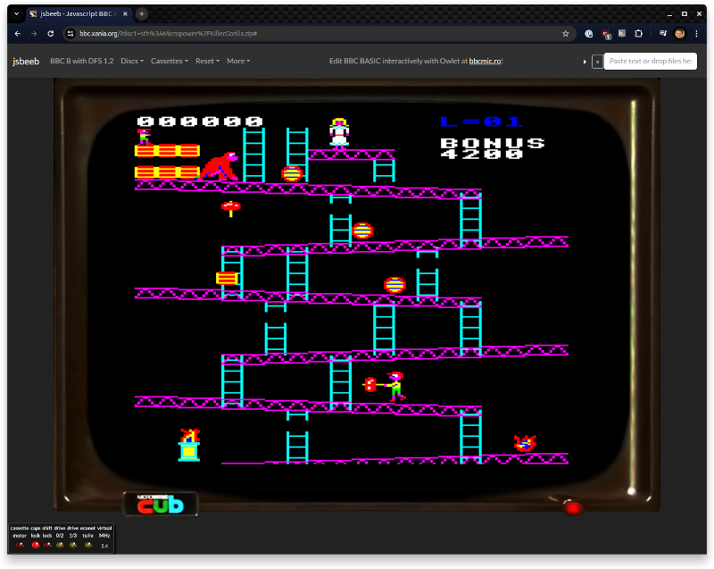

[](https://github.com/mattgodbolt/jsbeeb/actions/workflows/test-and-deploy.yml)

# jsbeeb - JavaScript BBC Micro Emulator

[](https://bbc.xania.org/)

A BBC Micro emulator written in JavaScript and running in modern browsers. Emulates a 32K BBC B (with sideways RAM)
and a 128K BBC Master, along with a number of different peripherals.

## Table of Contents

- [Keyboard Mappings](#keyboard-mappings)
- [Getting Set Up to Run Locally](#getting-set-up-to-run-locally)
- [URL Parameters](#url-parameters)
- [Patches](#patches)
- [Loading BASIC Files from GitHub Gists](#loading-basic-files-from-github-gists)
- [Things Left to Do](#things-left-to-do)
- [Tests](#tests)
- [Thanks](#thanks)
- [More Information](#more-information)
- [License](#license)
- [Contact](#contact)

## Keyboard Mappings

The BBC had a somewhat different-looking keyboard to a modern PC, and so it's useful to know some of the mappings:

- BBC `F0` is `F10`
- BBC `Break` key is `F12`
- BBC `*` is on `"` (if it doesn't work for you try shift-2)

To play right now, visit [https://bbc.xania.org/](https://bbc.xania.org/). To load the default disc image (Elite in this
case), press shift-F12 (which is shift-Break on the BBC).

### Joystick Support

jsbeeb supports both USB/Bluetooth gamepads and mouse-based analogue joystick emulation. Note that BBC Micro joysticks use inverted axes:

- X-axis: Left = 65535, Right = 0
- Y-axis: Up = 65535, Down = 0

## Getting Set Up to Run Locally

### Prerequisites

- Node.js (https://nodejs.org/)
- npm (comes with Node.js)

### Installation

1. Clone the repository:
   ```sh
   git clone https://github.com/mattgodbolt/jsbeeb.git
   cd jsbeeb
   ```
2. Install dependencies:
   ```sh
   npm install
   ```
3. Start the local webserver:
   ```sh
   npm start
   ```
4. Visit `http://localhost:5173/` in your browser.

jsbeeb uses Node.js and vite to afford simple and standard web development tooling and third-party library access
without lots of painful copy/paste or wheel-reinventing, as well as the ability to better run tests, and "pack" up the
site to make it smaller and faster to load when it's deployed to [https://bbc.xania.org](https://bbc.xania.org).

## URL Parameters

- `autoboot` - fakes a shift break
- `disc1=XXX` - loads disc XXX (from the `discs/` directory) into drive 1
- `disc2=XXX` - as above
- `disc1=local:YYY` - creates a local disk YYY which will be kept in browser local storage
- `disc1=sth:ZZZ` - loads disc ZZZ from the Stairway to Hell archive
- `tape=XXX` - loads tape XXX (from the `tapes/` directory)
- `tape=sth:ZZZ` - loads tape ZZZ from the Stairway to Hell archive
- `patch=P` - applies a memory patch `P`. See below.
- `loadBasic=X` - loads 'X' (a resource on the webserver) as text, tokenises it and puts it in `PAGE` as if you'd typed
  it in to the emulator
- `embedBasic=X` - loads 'X' (a URI-encoded string) as text, tokenises it and puts it in `PAGE` as if you'd typed it in
  to the emulator
- `autorun` - types `*TAPE` then `*/` to run from tape. In conjunction with `loadBasic` it types `RUN`.
- `autochain` - types `*TAPE` then `CH.""` to run from tape.
- `autotype` - types whatever you put after. e.g. `&autotype=PRINT"Matt is cool"%0a` (return is URI escaped to `%0a`)
- `embed` - Remove the margins around the screen, hide most navigation entries and make the page background
  transparent (intended for use when running within an iframe in a third-party site).
- `cpuMultiplier=X` speeds up the CPU by a factor of `X`. May be fractional or below one to slow the CPU down. NB disc
  loads become unreliable with a too-slow CPU, and running too fast might cause the browser to hang.
- `sbLeft` / `sbRight` / `sbBottom` - a URL to place left of, right of, or below the cub monitor. The left and right
  should be around 648 high and the bottom image should be around 896 wide. Left and right wider than 300 will run into
  problems on smaller screens; bottom taller than 100 or so similarly.
- `videoCyclesBatch` - the number of video cycles to batch up before running the video emulation. Defaults to zero:
  anything higher leads to emulation inaccuracies. Useful for showing why accuracy is important, even if less efficient.
- `rom` - load the given URL or path as an extra ROM. If a URL is provided, that URL must allow cross-site requests.
  Doesn't support the sth: pseudo URL unlike `disc` and `tape`, but if given a ZIP file will attempt to use the `.rom`
  file assumed to be within.
- (mostly internal use) `logFdcCommands`, `logFdcStateChanges` - turn on logging in the disc controller.
- `audioDebug=true` turns on some audio debug graphs.

## Patches

Patches can be applied by making a `patch=P` URL parameter. `P` is a sequence of semicolon-separated patches of the form
`@XXXX,YYYY:ZZZZZ,...` where the `@XXXX` specifies a PC address to breakpoint, the `YYYY` is the address to patch and
the `ZZZZ` is the data to write at address `YYYY`. The `@` part is optional, but is handy to ensure the code you want to
patch has actually loaded. For example: `patch=@31a6,0769:6e4c4d48465a` which is a patch for the default Elite image.
Once the PC has reached `$31a6`, the bytes at `0769` are replaced with `6e4c4d48465a`.

## Loading BASIC Files from GitHub Gists

1. Create a gist with your code. https://gist.github.com/ - here's
   an [example](https://gist.github.com/mattgodbolt/fc8d6f3d6e5e015dce399013719c8341)
2. Get the "Raw" link by clicking "raw" and copying the URL. In the case above
   that's: https://gist.githubusercontent.com/mattgodbolt/fc8d6f3d6e5e015dce399013719c8341/raw/bd5cb4314bfc3ee4330783ecf82cb329a36b915c/foo.bas
3. Add that after "https://bbc.xania.org/?autorun&loadBasic=" or similar, for
   example, [this link](https://bbc.xania.org/?loadBasic=https://gist.githubusercontent.com/mattgodbolt/fc8d6f3d6e5e015dce399013719c8341/raw/bd5cb4314bfc3ee4330783ecf82cb329a36b915c/foo.bas&autorun)

Note that every update you make means you need to make a new raw link.

## Things Left to Do

If you're looking to help:

- Testing
  - Play lots of games and report issues either on [GitHub](https://github.com/mattgodbolt/jsbeeb/issues) or by email (
    matt@godbolt.org).
- Core
  - Save state ability
    - Once we have this I'd love to get some "reverse step" debugging support
  - Get the "boo" of the boot "boo-beep" working (disabled currently as the JavaScript startup makes the sound
    dreadfully choppy on Chrome at least).
- Save disc support
  - Local discs need to be made more workable and need an "export" feature
  - Multiple discs need a UI
- `git grep -i todo`
- Optimisation
  - While every attempt to make things fast has been made, I'm sure there's some more clever things that can be done
    without compromising emulation accuracy

## Tests

For general correctness, there are several tests in the `tests` directory, including:

- Klaus Dormann's exhaustive [test of all documented opcodes](https://github.com/Klaus2m5/6502_65C02_functional_tests)
  for 6502 and 65C12. This is brought in as a git submodule from a forked version of Klaus's original as it needed a few
  tweaks to get 65C12 working.
- hoglet's Binary Coded Decimal tests.
- @dp111's [timing tests](https://github.com/dp111/6502Timing). Also brought in as a git submodule.
- A public domain Commodore 64 6502 test suite which tests every 6502 opcode (documented or otherwise) for every
  possible input and flags condition.
- Some tests by @scarybeasts testing VIA and 65C12 functionality.

For timing correctness, we have:

- A timing test program written by Rich. It has been run on a real live BBC B and the results are in the directory. An
  SSD of the same tests is in the `discs/` directory.
- Some of Kevin Edwards' protection systems (stripped of the games themselves). These are extremely timing- and
  correctness-sensitive when it comes to the timers and interrupts of the BBC.
- Some 65C12-specific read-modify-write tests written by Ed Spittles.

Tests can be run automatically if you have `node` installed - just run `make` and it'll ensure the relevant libraries
are installed, then it'll run the tests. Please note it can take a while to run the whole test suite.

## Thanks

jsbeeb was heavily based on Sarah Walker's C [B-Em emulator](https://github.com/stardot/b-em) -- thanks to her for her
hard work and for open sourcing her code. B-em is now being maintained by a group of enthusiasts - thanks to them too!

Huge thanks to Richard Talbot-Watkins for his advice and help along the way in fathoming out the instruction timings,
interrupt fun, video code rewrite and for being such a good pal all these many years!

Thanks to [Michael Borcherds](https://twitter.com/mike_geogebra) for his help; improving the keyboard layouts and
handling in JavaScript, reporting issues, chasing down game bugs and much more.

Thanks to [David Banks](https://github.com/hoglet67) (hoglet) for his help in testing the gnarly BCD flag behaviour on
real live BBCs.

Cheers to [Ed Spittles](https://github.com/BigEd) for testing various interrupt timing code on a real BBC.

Thanks to Chris Jordan for his thorough testing, bug reports, ideas and help.

A lot of the early development used the amazing [Visual 6502](http://visual6502.org/) as reference for intra-instruction
timings. Amazing stuff.

Special shout out to the users of the [6502 Forums](http://forum.6502.org/)

## More Information

I've written a lot about how the innards work on [my blog](http://xania.org) in
the [emulation](http://xania.org/Emulation-archive) section. I gave a presentation on how it all fits together at work,
and posted the [video up on YouTube](https://www.youtube.com/watch?v=37jyHQT7fXQ). I have another presentation at
[ABug](https://www.youtube.com/watch?v=ABmwJXMLzYM).

## License

This project is licensed under the MIT License - see the [LICENSE](LICENSE) file for details.

## Contact

For support or questions, please contact Matt Godbolt at matt@godbolt.org.
