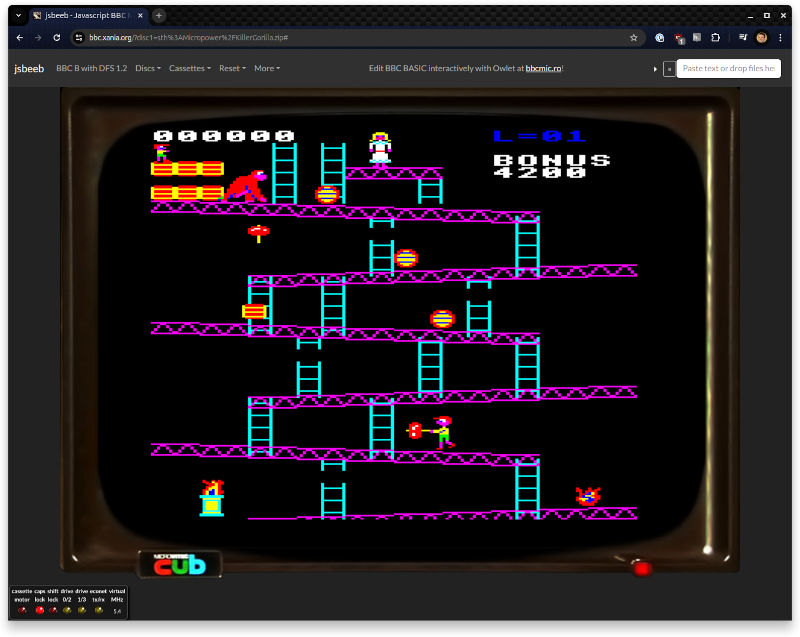

[](https://github.com/mattgodbolt/jsbeeb/actions/workflows/test-and-deploy.yml)

# jsbeeb - JavaScript BBC Micro Emulator

[](https://bbc.xania.org/)

A BBC Micro and other 8-bit Acorn emulator written in JavaScript and running in modern browsers. Emulates a 32K BBC B
(with sideways RAM), a 128K BBC Master, and an Acorn Atom (with AtoMMC2 SD card interface), along with a number of
different peripherals.

## Table of Contents

- [Keyboard Mappings](#keyboard-mappings)
- [Remapping Keys](#remapping-keys)
- [Emulator Shortcuts](#emulator-shortcuts)
- [Printer Output](#printer-output)
- [Save State and Rewind](#save-state-and-rewind)
- [Getting Set Up to Run Locally](#getting-set-up-to-run-locally)
- [Running as a Desktop Application](#running-as-a-desktop-application)
- [URL Parameters](#url-parameters)
- [Patches](#patches)
- [Loading BASIC Files from GitHub Gists](#loading-basic-files-from-github-gists)
- [Things Left to Do](#things-left-to-do)
- [Tests](#tests)
- [Thanks](#thanks)
- [More Information](#more-information)
- [License](#license)
- [Contact](#contact)

## Keyboard Mappings

The BBC had a somewhat different-looking keyboard to a modern PC, and so it's useful to know some of the mappings:

- BBC `F0` is `F10`
- BBC `Break` key is `F12`
- BBC `*` is on `"` (if it doesn't work for you try shift-2)

To play right now, visit [https://bbc.xania.org/](https://bbc.xania.org/). To load the default disc image (Elite in this
case), press shift-F12 (which is shift-Break on the BBC).

### Remapping Keys

Plenty of games use keys that are awkward on a modern keyboard: `COPY` (which is `End`, or `fn`+`→` on a Mac), or
`CAPS LOCK` (which on a Mac toggles rather than acting as a key you hold down). Any host key can be made to press any
BBC key by adding a `KEY.` parameter to the URL:

```
KEY.<host key>=<BBC key>
```

Add one for each key you want to change. For example, Superior Software's Space Invaders fires with `COPY`; this makes
`Enter` fire instead:

[`https://bbc.xania.org/?disc1=sth:Superior/SpaceInvaders-Superior.zip&autoboot&KEY.ENTER=COPY`](https://bbc.xania.org/?disc1=sth:Superior/SpaceInvaders-Superior.zip&autoboot&KEY.ENTER=COPY)

Superior's Frogger uses `A`/`Z`/`DELETE`/`COPY` to move; this puts it on the arrow keys:

[`https://bbc.xania.org/?disc1=sth:Superior/Frogger-Superior.zip&autoboot&KEY.UP=A&KEY.DOWN=Z&KEY.LEFT=DELETE&KEY.RIGHT=COPY`](https://bbc.xania.org/?disc1=sth:Superior/Frogger-Superior.zip&autoboot&KEY.UP=A&KEY.DOWN=Z&KEY.LEFT=DELETE&KEY.RIGHT=COPY)

And Superior's Hunchback steers with `CAPS LOCK` and `CTRL`, which the arrow keys can stand in for:

[`https://bbc.xania.org/?disc1=sth:Superior/Hunchback-Superior.zip&autoboot&KEY.LEFT=CAPSLOCK&KEY.RIGHT=CTRL`](https://bbc.xania.org/?disc1=sth:Superior/Hunchback-Superior.zip&autoboot&KEY.LEFT=CAPSLOCK&KEY.RIGHT=CTRL)

The **host key** names are jsbeeb's names for the keys on your own keyboard. Most are what you'd expect, but note:

- `ENTER` (the BBC's `RETURN` key is called `ENTER` on the host side)
- `K0` to `K9` for the number keys, `NUMPAD0` to `NUMPAD9` for the keypad
- `SHIFT_LEFT` / `SHIFT_RIGHT`, `CTRL_LEFT` / `CTRL_RIGHT`, `ALT_LEFT` / `ALT_RIGHT` to distinguish the two of each
- `BACK_QUOTE`, `APOSTROPHE`, `SEMICOLON`, `MINUS`, `EQUALS`, `HASH`, `BACKSLASH`, `LEFT_SQUARE_BRACKET`,
  `RIGHT_SQUARE_BRACKET` for punctuation

The **BBC key** names are:

```
RETURN COPY DELETE ESCAPE TAB SPACE SHIFT SHIFTLOCK CAPSLOCK CTRL
LEFT RIGHT UP DOWN
A-Z, K0-K9 (the number keys), F0-F9 (the red function keys)
SEMICOLON_PLUS MINUS COMMA PERIOD SLASH AT COLON_STAR HAT_TILDE
UNDERSCORE_POUND PIPE_BACKSLASH LEFT_SQUARE_BRACKET RIGHT_SQUARE_BRACKET

(and, on the Master's numeric keypad only)
NUMPAD0-NUMPAD9 NUMPADPLUS NUMPADMINUS NUMPADSLASH NUMPADASTERISK NUMPADCOMMA
NUMPADHASH NUMPADENTER NUMPAD_DELETE NUMPAD_DECIMAL_POINT
```

Some things to know:

- Names are case-insensitive, and a remapped key ignores the `SHIFT` state, so `KEY.ENTER=COPY` presses `COPY` whether
  or not shift is held.
- Remapping replaces what that host key normally does; in the Space Invaders example above, `Enter` no longer presses
  `RETURN`.
- The remapping is applied on top of whichever keyboard layout is selected, and survives changing layout or model.
- If a name isn't recognised the mapping is skipped, and the emulator says so on startup, naming the parameter that
  was at fault.
- On the Atom, use the Atom's own key names (`LOCK`, `UP_DOWN`, `LEFT_RIGHT` and so on) rather than the BBC's.

The definitive lists are `keyCodes` (host) and `BBC` (BBC micro) in [`src/utils.js`](src/utils.js), and `ATOM` in
[`src/utils_atom.js`](src/utils_atom.js).

### Emulator Shortcuts

| Shortcut       | Action                          |
| -------------- | ------------------------------- |
| `Ctrl+Home`    | Stop and enter debugger         |
| `Ctrl+Insert`  | Toggle turbo (fast-as-possible) |
| `Ctrl+End`     | Pause emulation                 |
| `Ctrl+B`       | Open printer output window      |
| `Alt+PageDown` | Open rewind scrubber            |

### Printer Output

Anything the machine prints is captured whether or not the printer window is open, so programs that print (with `VDU 2`, `*FX5,1` and the like) run rather than waiting for a printer that is not there.

Press `Ctrl+B` to open a window showing what has been printed so far; it then keeps up with the output as it arrives. Only the most recent output is kept, roughly a dozen pages' worth, so a program printing forever cannot fill memory.

### Save State and Rewind

Save and load full emulator state snapshots from the **State** menu (or `Ctrl+S` / `Ctrl+O` in the Electron app).

The emulator continuously captures snapshots into a 30-slot rewind buffer (~1 per second). Open the rewind scrubber from **State > Rewind** or press **Alt+PageDown** to browse recent states as a visual filmstrip:

- **Left/Right arrows** — navigate between snapshots (the main screen updates live)
- **Click** a thumbnail to jump to that point
- **Enter** — commit selection and close the panel
- **Escape** — cancel and restore the original state

### Joystick Support

jsbeeb supports both USB/Bluetooth gamepads and mouse-based analogue joystick emulation. Note that BBC Micro joysticks use inverted axes:

- X-axis: Left = 65535, Right = 0
- Y-axis: Up = 65535, Down = 0

A gamepad presses BBC keys, and which key each control presses can be changed from the URL in the same way as
[remapping the keyboard](#remapping-keys):

```
GP.<gamepad control>=<BBC key>
```

By default the D-pad presses the "Snapper" keys (`Z`, `X`, `:`, `/`), the `A` button presses `RETURN` and `Start`
presses `SPACE`. To play Superior's Space Invaders on a pad, where `COPY` fires:

[`https://bbc.xania.org/?disc1=sth:Superior/SpaceInvaders-Superior.zip&autoboot&GP.FIRE=COPY`](https://bbc.xania.org/?disc1=sth:Superior/SpaceInvaders-Superior.zip&autoboot&GP.FIRE=COPY)

The gamepad control names are:

- `FIRE` — every button at once, which is usually what you want for a one-button game
- `UP` `DOWN` `LEFT` `RIGHT` — both analogue sticks at once, plus one face button each (`UP` is also `A`, `DOWN` is
  `X`, `LEFT` is `Y`, `RIGHT` is `B`)
- `UP1` `DOWN1` `LEFT1` `RIGHT1` — the left stick only; `UP2` `DOWN2` … — the right stick only; `UP3` `DOWN3` … — the
  face buttons only
- `A` `B` `X` `Y` `START` `BACK` `LB` `RB` `LT` `RT` — individual buttons, by their Xbox 360 names
- `FIRE1` `FIRE2` — clicking the left and right sticks

The BBC key names are the same as for the keyboard, and digits may be written either way round: `GP.A=1` and `GP.A=K1`
both press `1`. Unlike `KEY.`, gamepad mappings are BBC-only: there's no Atom equivalent. The D-pad's default mapping
can't currently be changed.

The older `LEFT=`, `RIGHT=`, `UP=`, `DOWN=` and `FIRE=` parameters (no `GP.` prefix) still work and mean the same
thing.

## Getting Set Up to Run Locally

### Prerequisites

- Node.js (https://nodejs.org/)
- npm (comes with Node.js)

### Installation

1. Clone the repository:
   ```sh
   git clone https://github.com/mattgodbolt/jsbeeb.git
   cd jsbeeb
   ```
2. Install dependencies:
   ```sh
   npm install
   ```
3. Start the local webserver:
   ```sh
   npm start
   ```
4. Visit `http://localhost:5173/` in your browser.

jsbeeb uses Node.js and vite to afford simple and standard web development tooling and third-party library access
without lots of painful copy/paste or wheel-reinventing, as well as the ability to better run tests, and "pack" up the
site to make it smaller and faster to load when it's deployed to [https://bbc.xania.org](https://bbc.xania.org).

## Running as a Desktop Application

jsbeeb can also run as a standalone desktop application using Electron:

### Running in Development

```sh
npm run electron
```

This automatically builds the latest code before launching Electron.

### Building Distributable Packages

To build packages for Linux distribution:

```sh
npm run build
npm run electron:build
```

This creates two package formats in `out/dist/`:

- **Debian/Ubuntu**: `.deb` package
- **Fedora/RHEL**: `.rpm` package

**Why no Snap packages?** electron-builder's snap support uses the outdated `gnome-3-28-1804` platform (Ubuntu 18.04), which causes GPU driver incompatibilities on modern systems, resulting in MESA loader failures and segfaults. While we were able to work around the initial Wayland issues (electron-builder sets `DISABLE_WAYLAND=1` by default, fixed with `allowNativeWayland: true`), the GPU problems proved insurmountable. The snap builder hasn't been updated to support modern bases like `core22` or `core24`. The `.deb` package works perfectly on all Debian-based systems.

**Note for Ubuntu/Debian users:** If you encounter RPM build errors, you may need to use the system FPM package manager instead of electron-builder's bundled version. First, install the required dependencies:

```sh
sudo apt-get install ruby rubygems build-essential
sudo gem install fpm
```

Then build with:

```sh
USE_SYSTEM_FPM=true npm run electron:build
```

### Installing the Packaged Application

**Debian/Ubuntu:**

```sh
sudo apt install ./out/dist/jsbeeb_1.0.1_amd64.deb
```

**Fedora/RHEL/CentOS:**

```sh
sudo rpm -i out/dist/jsbeeb-1.0.1.x86_64.rpm
```

**Note:** Electron support was re-enabled in November 2024 after being disabled during the ESM migration in 2021. It now works with Electron 28+ which added full ES Modules support.

## URL Parameters

- `autoboot` - fakes a shift break
- `disc1=XXX` - loads disc XXX (from the `discs/` directory) into drive 0
- `disc2=XXX` - as above, into drive 1
- `disc1=local:YYY` - creates a local disk YYY which will be kept in browser local storage
- `disc1=sth:ZZZ` - loads disc ZZZ from the Stairway to Hell archive
- `drive0Tracks=40` / `drive0Tracks=80` - fixes drive 0's 40/80 track switch, as the switch on the back of a real
  drive did. `drive1Tracks` does the same for drive 1. Left alone, each drive follows whatever disc is loaded into it:
  a 40 track image is laid out the way a 40 track drive wrote it, on every other track of the surface, and the drive
  double steps to read it. `40` reads an 80 track disc through a double stepping head, which is as much of a mess as it
  was in 1985. `80` turns all of this off for that drive, loading every image the way jsbeeb did before it could tell
  them apart. [docs/disc-track-layouts.md](docs/disc-track-layouts.md) explains how an image's layout is worked out.
- `tape=XXX` - loads tape XXX (from the `tapes/` directory)
- `tape=sth:ZZZ` - loads tape ZZZ from the Stairway to Hell archive
- `KEY.X=Y` - makes host key `X` press BBC key `Y`, e.g. `KEY.ENTER=COPY`. See
  [Remapping Keys](#remapping-keys).
- `patch=P` - applies a memory patch `P`. See below.
- `loadBasic=X` - loads 'X' (a resource on the webserver) as text, tokenises it and puts it in `PAGE` as if you'd typed
  it in to the emulator
- `embedBasic=X` - loads 'X' (a URI-encoded string) as text, tokenises it and puts it in `PAGE` as if you'd typed it in
  to the emulator
- `autorun` - types `*TAPE` then `*/` to run from tape. In conjunction with `loadBasic` it types `RUN`.
- `autochain` - types `*TAPE` then `CH.""` to run from tape.
- `autotype` - types whatever you put after. e.g. `&autotype=PRINT"Matt is cool"%0a` (return is URI escaped to `%0a`)
- `embed` - Remove the margins around the screen, hide most navigation entries and make the page background
  transparent (intended for use when running within an iframe in a third-party site).
- `cpuMultiplier=X` speeds up the CPU by a factor of `X` relative to the peripherals: video, sound and the VIAs keep
  running at their real-world rates. May be fractional or below one to slow the CPU down. NB disc loads become
  unreliable with a too-slow CPU, and running too fast might cause the browser to hang.
- `tubeCpuMultiplier=X` overclocks the second processor by a factor of `X`, which may be fractional. `1`, the default,
  runs it at the real part's own clock: 3MHz for the 6502 second processor a BBC B takes, 4MHz for the 65C102 Turbo
  board a Master takes. Below about 2.2MHz the MOS's unhandshaken tube transfers lose data.
- `sbLeft` / `sbRight` / `sbBottom` - a URL to place left of, right of, or below the cub monitor. The left and right
  should be around 648 high and the bottom image should be around 896 wide. Left and right wider than 300 will run into
  problems on smaller screens; bottom taller than 100 or so similarly.
- `videoCyclesBatch` - the number of video cycles to batch up before running the video emulation. Defaults to zero:
  anything higher leads to emulation inaccuracies. Useful for showing why accuracy is important, even if less efficient.
- `rom` - load the given URL or path as an extra ROM. If a URL is provided, that URL must allow cross-site requests.
  Doesn't support the sth: pseudo URL unlike `disc` and `tape`, but if given a ZIP file will attempt to use the `.rom`
  file assumed to be within.
- (mostly internal use) `logFdcCommands`, `logFdcStateChanges` - turn on logging in the disc controller.
- `audioDebug` - show the audio lead chart, and log one console line per second in which the emulator tick ran late or the sound stalled or skipped.
- `audioLatencyMs` - how far the sound runs behind the emulator, in milliseconds (default 20). Raising it lets the sound ride out longer stalls of the emulator, at the cost of lagging the picture by that much.
- `displayMode=X` - picks the display: `rgb` (the default, a plain monitor), `pal` (a television on a composite lead)
  or `xbr` (an upscaler, see [docs/xbr-display-mode.md](docs/xbr-display-mode.md)).

### Atom-specific parameters

- `model=Atom` - select the Acorn Atom (MMC) model. Other Atom variants: `Atom-Tape`, `Atom-Tape-FP`, `Atom-DOS`.
- `mmc=XXX` - load an MMC/SD card image (ZIP) for the Atom.

Atom models can also be selected automatically by hostname: any hostname starting with `atom` (e.g. `atom.xania.org`)
defaults to the Atom model.

## Patches

Patches can be applied by making a `patch=P` URL parameter. `P` is a sequence of semicolon-separated patches of the form
`@XXXX,YYYY:ZZZZZ,...` where the `@XXXX` specifies a PC address to breakpoint, the `YYYY` is the address to patch and
the `ZZZZ` is the data to write at address `YYYY`. The `@` part is optional, but is handy to ensure the code you want to
patch has actually loaded. For example: `patch=@31a6,0769:6e4c4d48465a` which is a patch for the default Elite image.
Once the PC has reached `$31a6`, the bytes at `0769` are replaced with `6e4c4d48465a`.

## Loading BASIC Files from GitHub Gists

1. Create a gist with your code. https://gist.github.com/ - here's
   an [example](https://gist.github.com/mattgodbolt/fc8d6f3d6e5e015dce399013719c8341)
2. Get the "Raw" link by clicking "raw" and copying the URL. In the case above
   that's: https://gist.githubusercontent.com/mattgodbolt/fc8d6f3d6e5e015dce399013719c8341/raw/bd5cb4314bfc3ee4330783ecf82cb329a36b915c/foo.bas
3. Add that after "https://bbc.xania.org/?autorun&loadBasic=" or similar, for
   example, [this link](https://bbc.xania.org/?loadBasic=https://gist.githubusercontent.com/mattgodbolt/fc8d6f3d6e5e015dce399013719c8341/raw/bd5cb4314bfc3ee4330783ecf82cb329a36b915c/foo.bas&autorun)

Note that every update you make means you need to make a new raw link.

## Things Left to Do

If you're looking to help:

- Testing
  - Play lots of games and report issues either on [GitHub](https://github.com/mattgodbolt/jsbeeb/issues) or by email (
    matt@godbolt.org).
- Core
  - Get the "boo" of the boot "boo-beep" working (disabled currently as the JavaScript startup makes the sound
    dreadfully choppy on Chrome at least).
- Save disc support
  - Local discs need to be made more workable and need an "export" feature
  - Multiple discs need a UI
- `git grep -i todo`
- Optimisation
  - While every attempt to make things fast has been made, I'm sure there's some more clever things that can be done
    without compromising emulation accuracy

## Tests

For general correctness, there are several tests in the `tests` directory, including:

- Klaus Dormann's exhaustive [test of all documented opcodes](https://github.com/Klaus2m5/6502_65C02_functional_tests)
  for 6502 and 65C12. This is brought in as a git submodule from a forked version of Klaus's original as it needed a few
  tweaks to get 65C12 working.
- hoglet's Binary Coded Decimal tests.
- @dp111's [timing tests](https://github.com/dp111/6502Timing). Also brought in as a git submodule.
- A public domain Commodore 64 6502 test suite which tests every 6502 opcode (documented or otherwise) for every
  possible input and flags condition.
- Some tests by @scarybeasts testing VIA and 65C12 functionality.

For timing correctness, we have:

- A timing test program written by Rich. It has been run on a real live BBC B and the results are in the directory. An
  SSD of the same tests is in the `discs/` directory.
- Some of Kevin Edwards' protection systems (stripped of the games themselves). These are extremely timing- and
  correctness-sensitive when it comes to the timers and interrupts of the BBC.
- Some 65C12-specific read-modify-write tests written by Ed Spittles.

Tests can be run automatically if you have `node` installed - just run `make` and it'll ensure the relevant libraries
are installed, then it'll run the tests. Please note it can take a while to run the whole test suite.

## Thanks

jsbeeb was heavily based on Sarah Walker's C [B-Em emulator](https://github.com/stardot/b-em) -- thanks to her for her
hard work and for open sourcing her code. B-em is now being maintained by a group of enthusiasts - thanks to them too!

Huge thanks to Richard Talbot-Watkins for his advice and help along the way in fathoming out the instruction timings,
interrupt fun, video code rewrite and for being such a good pal all these many years!

Thanks to [Michael Borcherds](https://twitter.com/mike_geogebra) for his help; improving the keyboard layouts and
handling in JavaScript, reporting issues, chasing down game bugs and much more.

Thanks to [David Banks](https://github.com/hoglet67) (hoglet) for his help in testing the gnarly BCD flag behaviour on
real live BBCs.

Cheers to [Ed Spittles](https://github.com/BigEd) for testing various interrupt timing code on a real BBC.

Thanks to Chris Jordan for his thorough testing, bug reports, ideas and help.

Huge thanks to [Andrew Hague](https://github.com/CommanderCoder) (CommanderCoder) for the Acorn Atom emulation
support. Andrew developed the original Atom implementation including the MC6847 video chip, 8255 PPIA, AtoMMC2 SD card
interface, Atom keyboard mapping, tape support, and speaker output. His work in [PR #505](https://github.com/mattgodbolt/jsbeeb/pull/505)
was incrementally merged and refined into the codebase.

A lot of the early development used the amazing [Visual 6502](http://visual6502.org/) as reference for intra-instruction
timings. Amazing stuff.

Special shout out to the users of the [6502 Forums](http://forum.6502.org/)

## More Information

I've written a lot about how the innards work on [my blog](http://xania.org) in
the [emulation](http://xania.org/Emulation-archive) section. I gave a presentation on how it all fits together at work,
and posted the [video up on YouTube](https://www.youtube.com/watch?v=37jyHQT7fXQ). I have another presentation at
[ABug](https://www.youtube.com/watch?v=ABmwJXMLzYM).

## License

This project is licensed under the MIT License - see the [LICENSE](LICENSE) file for details.

## Contact

For support or questions, please contact Matt Godbolt at matt@godbolt.org.
