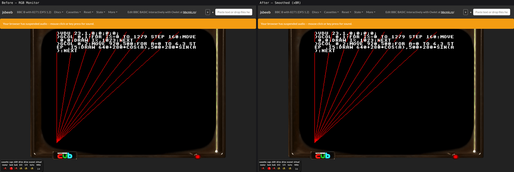
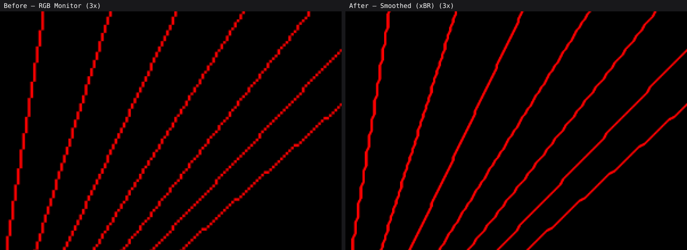

# The xBR display mode

`Smoothed (xBR)` is a third display mode alongside `RGB Monitor` and `PAL TV`,
selectable from the display menu or with `?displayMode=xbr`. It runs
[xBR-lv2](https://forums.libretro.com/t/xbr-algorithm-tutorial/123), Hyllian's
edge-directed pixel-art upscaler, over the picture, so that diagonals are drawn
as smooth lines rather than staircases.





## The logical pixel grid

The interesting part is not the algorithm — that is a port of a well-known
shader — but what it is applied to.

jsbeeb's framebuffer is a 1024-wide **raster**, not a grid of BBC pixels. One
logical pixel covers several framebuffer texels:

- horizontally, `Video.blitFb` writes `pixelsPerChar` texels per byte, so a
  logical pixel is 1, 2, 4 or 8 texels wide depending on the ULA's colour bits.
  It is one texel in MODE 0, two in MODE 1 and four in MODE 2 and MODE 5;
- vertically, non-interlaced modes write each CRTC scanline into two adjacent
  framebuffer rows, so logical pixels are usually two texels tall.

An upscaler that samples raw texel neighbours therefore finds nine copies of the
same pixel in its 3x3 neighbourhood, decides there is no edge anywhere, and
leaves the picture exactly as it found it. This is not hypothetical: it is why
[#667](https://github.com/mattgodbolt/jsbeeb/pull/667), an earlier attempt at
this feature, produced no visible difference at all.

Only `Video` knows the grid, and it changes during a frame — a MODE 7 status
line above a MODE 1 playfield is routine — so `Video` records one descriptor byte
per framebuffer row in `lineGrid`:

| bits | meaning                                     |
| ---- | ------------------------------------------- |
| 0-2  | the pixel's width in texels, less one       |
| 3    | set if the scanline was written to two rows |
| 7    | set if the row was rendered at all          |

The width is stored less one so it needs no logarithm to write and no
exponential to read, and so that any width from one to eight can be described —
the Atom's 6847 uses widths the BBC's ULA never selects, and records the same
descriptor from its own blitters. MODE 7 is recorded as one texel per pixel,
because the SAA5050 emulation writes each of its 16 texels per character
individually and its output is already at the framebuffer's own resolution.

A row whose mode changes part way along keeps only the last mode on it. That is
enough for a raster split, which is what people write; it is not enough for a
mid-line one.

`src/video-filters/pixel-grid.js` owns the encoding and the code that turns a
frame into bands of constant pixel size. The filter uploads `lineGrid` as a
one-pixel-wide luminance texture each frame, and the shader reads it to decide
what a "pixel" means on the row it is drawing.

## Two implementations

There are two copies of the algorithm, deliberately:

- `src/video-filters/xbr.js` — a literal JavaScript port, unit tested, which is
  the reference;
- `src/video-filters/shaders/xbr.frag.glsl` — the GLSL that actually runs.

Node has no WebGL, so the shader cannot be unit tested in the normal way.
`tools/verify-xbr-shader.js` closes the gap: it captures frames from a real
emulated machine, renders them through the real shader in headless Chrome, and
compares the result against the JavaScript reference pixel by pixel. Agreement is
within a handful of pixels per frame, all of them at the picture's outer edge
where the two clamp differently.

Keep the two in step. If you change one, run:

```sh
node tools/verify-xbr-shader.js
```

`tools/upscale-preview.js` is the other half of the toolkit: it renders the same
scenes through today's bilinear path, nearest-neighbour, and xBR, and writes
side-by-side PNGs. It needs no browser, so it is the quick way to judge a
parameter change.

## What it does and does not suit

- **Graphics modes (1, 2, 4, 5)** are what the mode is for. Diagonals and curves
  become continuous.
- **MODE 0** is barely changed. At 640 pixels across and one texel per pixel
  there is little for the filter to reconstruct, and text stays crisp.
- **Chunky text in MODE 2 and MODE 5** is where opinions differ. Twenty columns
  across, each character only eight logical pixels wide, they get noticeably
  rounded.
- **MODE 7** is left alone. The SAA5050's own character rounding has already
  smoothed the glyphs, so the filter finds almost no edges to work on.

The mode also asks for a canvas twice the usual size — exactly twice, so the
aspect ratio and the monitor placement are unchanged — because there is no point
reconstructing detail with nowhere to put it.

## Attribution

The algorithm is Hyllian's, from
`edge-smoothing/xbr/shaders/xbr-lv2-standalone.slang` in libretro's
slang-shaders, Copyright (C) 2011-2022 Hyllian \<sergiogdb@gmail.com\>, MIT
licensed, incorporating ideas from Joshua Street's SABR shader. The notice is
kept in both `xbr.js` and `xbr.frag.glsl`.

Note that the older `xbr/shaders/xbr-lv2.glsl` in libretro's **glsl**-shaders
repository declares `f4` and never assigns it, so it reads an uninitialised
`vec4`. Use the standalone slang version as the reference, not that one.
